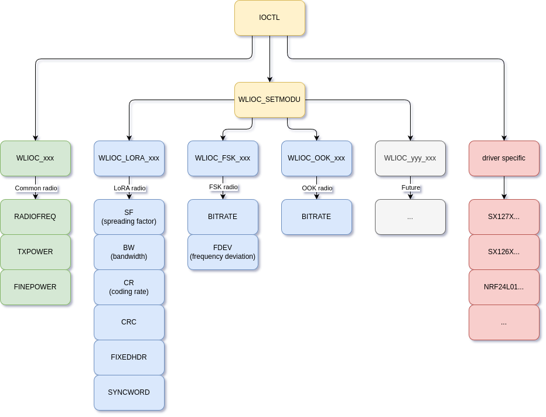

# Wireless character drivers

> lpwan/index.rst

## IOCTL Interface

Before this interface, the IOCTL API for character-driven RF devices
lacked a common interface across different modulation technologies, such
as LoRa, FSK, and OOK. The result was, driver-specific IOCTL commands
were created even when they could be shared across multiple radios. This
fragmentation made application portability more difficult to maintain.

To solve this issue, groups of commands have been created that are
"selected" by using `WLIOC_SETMODU`. See image below for a
representation.

Note

This image does not show all features. This is purely a representation
of command relations under WLIOC\_SETMODU.

### read()

Reading a radio will take a `wlioc_rx_hdr_s`, where information about
the payload will be read and written to.

  - `FAR uint8_t *payload_buffer` Pointer to **user buffer**. This is
    where the payload will be written to.
  - `size_t payload_length` **Initially**: User must set this to the
    size of `payload_buffer`. **After reading**: This will become the
    amount of bytes written to the `payload_buffer`.
  - `uint8_t error` When greater than 0, there are errors detected in
    the payload. The payload can still be returned, which allows the
    user to repair it if desired.
  - `int32_t rssi_dbm` The Received Signal Strength Indicator in 1/100
    decibel-milliwatts of the received signal. When unsupported, this
    returns `INT32_MIN`.
  - `int32_t snr_db` The signal to noise ratio in 1/100 decibels of the
    received signal. When unsupported, this returns `INT32_MIN`.

### write()

Writing to a radio will attempt to send the given bytes. The radio must
be configured before doing so. Unlike `read()`, this will simply take
uint8\_t bytes as payload.
