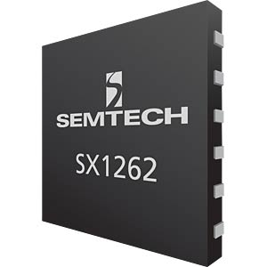
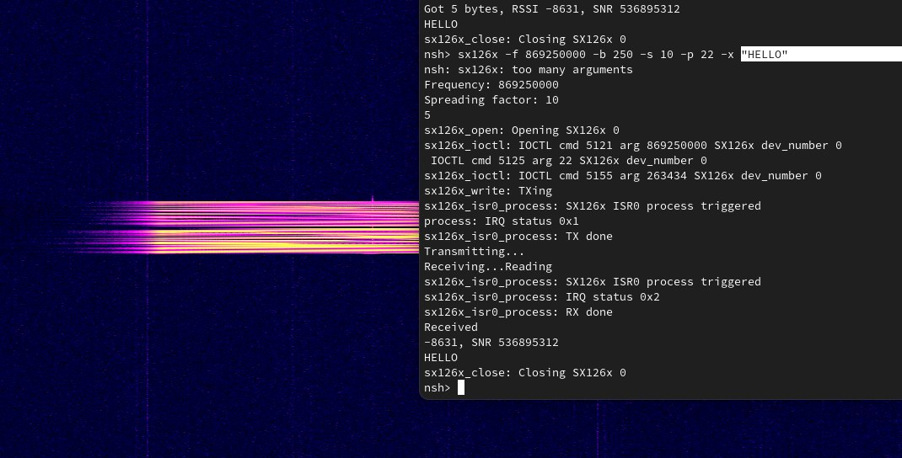

SX126x LoRa driver
==================

**Currently experimental. Changes can happen in the near future**

Short introduction SX126x
-------------------------

{.align-right}

The SX126x is a LoRa chip by Semtech. Sometimes also found in chips with
a different name but the same or similar sillicon underneath. The older
variant is the SX127x, even with its higher number. The SX126x series
promises to improve the link budget. They also added extra spreading
factors.

Userspace API
-------------

This driver is controlled as a character device and using IOCTL
commands. At the time of writing this 24 February, 2025, there is no
common API **yet** for LoRa devices and other RF devices under `/lpwan`.
Currently this driver is controlled using older and driver specific
IOCTL commands.

### Basic RF IOCTL

See `nuttx/wireless/ioctl.h` : `WLIOC_x` for setting the basic radio
parameters such as frequency and power. Please note that frequency and
power may be limited by the lower driver part at board logic.

### Driver dedicated IOCTL

See `nuttx/wireless/lpwan/sx126x.h` : `SX126XIOC_x` for the commands.

-   The packet type is set using `SX126XIOC_PACKETTYPESET` which takes
    `sx126x_packet_type_e` enums. **Currently only LoRa packet type is
    supported.**
-   LoRa modulation and LoRa packets are configured using
    `SX126XIOC_LORACONFIGSET` which takes a pointer to a
    `sx126x_lora_config_s` struct. This struct contains two separate
    structures for modulation and packet config. It is recommended to
    follow the SX126x datasheet at
    <https://www.semtech.com/products/wireless-rf/lora-connect/sx1262>
    that gives more details about each parameter.

### Reading / Writing

Reading and writing is done with the `read` and `write` functions.

-   `write` directly transmits the given bytes using the IOCTL
    configured parameters. **Does not support polling or timeout yet.**
-   `read` takes a pointer to `sx126x_read_header_s`, which contains
    information about the received packet. **RSSI and SNR aren\'t
    implemented yet**. *Note that packets are always received, even when
    the CRC (checked using \`\`.crc\_error\`\`) failed.*

Board implementation
--------------------

The driver can be registered in board logic using `sx126x_register`,
which takes an SPI bus, lower driver and the path. More information
about `struct sx126x_lower_s` parameters can be found in detail under
`nuttx/wireless/lpwan/sx126x.h` : `struct sx126x_lower_s`.

This driver supports multiple instances using `dev_number` found in
`sx126x_lower_s`. This is done so multiple channels of LoRa can work at
the same time.

**Do not assign random numbers in get\_pa\_values. This can damage the
device depending on model. Refer to the manual**

Testing
-------

A simple ping-pong test is made to test the device. This code can be
used as an example. It is found here <https://pastebin.com/71CdKZvm> It
takes the following parameters:

-   `-f` sets frequency in hz. The range is board depended.
-   `-b` sets the bandwidth in kHz and automatically selects the closest
    sx126x supported bandwidth.
-   `-s` sets the spreading factor between 5 and 12.
-   `-p` sets the power in dBm. The range is board depended. Also PA
    setting depended.
-   `-t` perform transmit. Transmit the following bytes.
-   `-r` perform receive. Receives and print.
-   `-x` perform transmit and receive. Transmits following bytes and
    attempts to receives immediately. To be used with `-e` echo
-   `-e` perform echo. Listen and repeat.

{.align-center}
