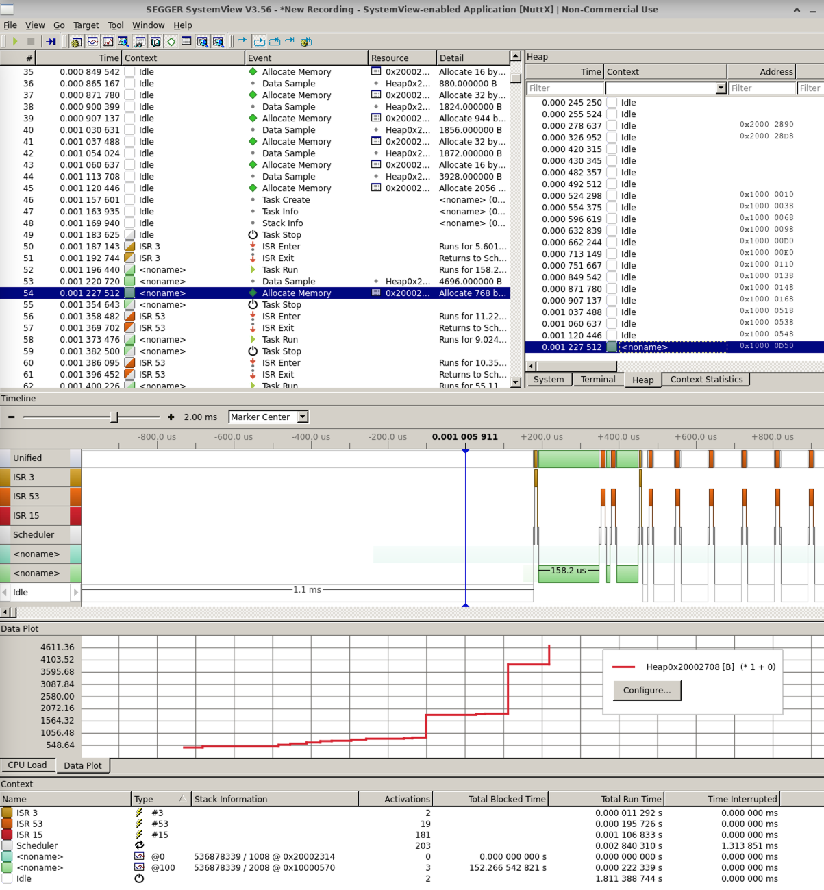

# Segger RTT drivers

Note

Segger drivers works only with J-Link debug probes. Sometimes it's
possible to replace vendor-specific debug interface with J-Link OB
firmware. For details look at [Segger
website](https://www.segger.com/downloads/jlink)

Supported Segger drivers:

  - Serial over RTT - `CONFIG_SERIAL_RTTx`,
  - Console over RTT - `CONFIG_SERIAL_RTT_CONSOLE_CHANNEL`
  - Segger SystemView - `CONFIG_SEGGER_SYSVIEW`
  - Note RTT - `CONFIG_NOTE_RTT`

## Segger SystemView

1.  Steps to enable SystemView support:

2.  Make sure your architecture supports a high-performance counter. In
    most cases it will be:
    
    `CONFIG_ARCH_PERF_EVENTS=y`
    
    In that case, the the architecture logic must initialize the perf
    counter with `up_perf_init()`.

3.  Enable instrumentation support:
    
    `CONFIG_SCHED_INSTRUMENTATION=y`

4.  Configure instrumentation support. Available options for SystemView
    are:
    
    `CONFIG_SCHED_INSTRUMENTATION_SWITCH=y`
    
    `CONFIG_SCHED_INSTRUMENTATION_SYSCALL=y`
    
    `CONFIG_SCHED_INSTRUMENTATION_IRQHANDLER=y`

5.  Make sure that `CONFIG_TASK_NAME_SIZE > 0`, otherwise task/thread
    names will not be displayed correctly

6.  Enable Note Driver support and disable Note RAM driver:
    
    `CONFIG_DRIVERS_NOTE=y`
    
    `CONFIG_DRIVERS_NOTERAM=n`

7.  Enable Note RTT and Segger SystemView support:
    
    `CONFIG_NOTE_RTT=y`
    
    `CONFIG_SEGGER_SYSVIEW=y`

8.  Configure RTT channel and RTT buffer size for SystemView:
    
    `CONFIG_SEGGER_SYSVIEW_RTT_CHANNEL=0`
    
    `CONFIG_SEGGER_SYSVIEW_RTT_BUFFER_SIZE=1024`
    
    In case SystemView returns buffer overflow errors, you should
    increase `CONFIG_NOTE_RTT_BUFFER_SIZE_UP`.

9.  Use SystemView for heap tracing:

Refer to example configuration at `stm32f429i-disco/configs/systemview`.
Make sure that `CONFIG_SCHED_INSTRUMENTATION_HEAP` is enabled.

Example of screenshot from SystemView:

