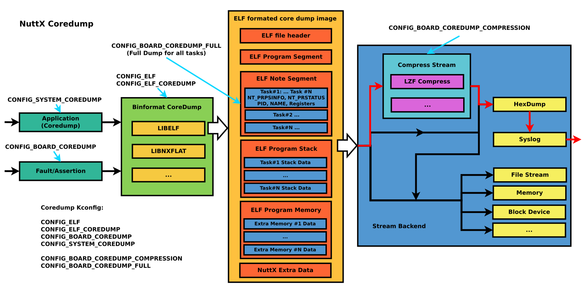
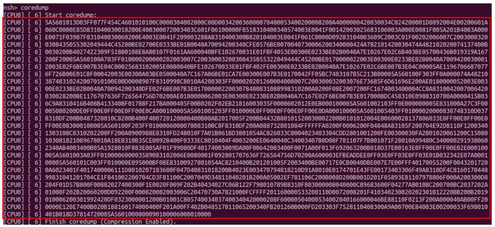
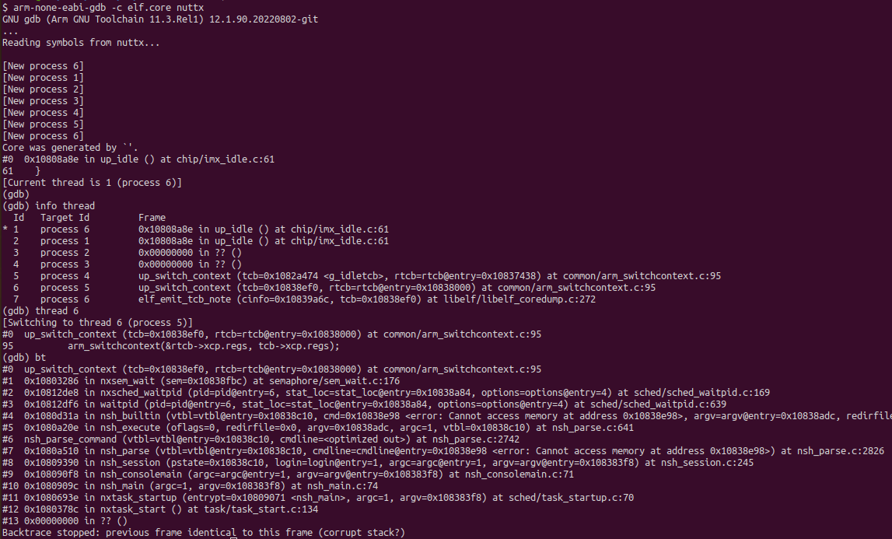

Core Dump
=========

Overview
--------



### How to use

1.  Enable NuttX Core dump

Enable Kconfig

> ``` {.console}
> CONFIG_COREDUMP=y                   /* Enable Coredump */
>
> CONFIG_BOARD_COREDUMP_SYSLOG=y      /* Enable Board Coredump, if exceptions and assertions occur, */
>
> CONFIG_SYSTEM_COREDUMP=y            /* Enable coredump in user command, which can capture the current
>                                        state of one or all threads when the system is running, the
>                                        output can be redirect to console or file */
>
> CONFIG_BOARD_COREDUMP_COMPRESSION=y /* Default y, enable Coredump compression to
>                                        reduce the size of the original core image */
>
> CONFIG_BOARD_COREDUMP_FULL=y        /* Default y, save all task information */
> ```

2.  Run Coredump on nsh (CONFIG\_SYSTEM\_COREDUMP=y)

Parameters of coredump tool

> ``` {.console}
>  coredump <pid>        /* If pid is specified, coredump will only capture the thread with the
>                            specified pid, otherwise all threads will be captured */
>
>  coredump <filename>   /* If filename is specified, then coredump will be output to the specified
>                            file by default, otherwise it will be redirect in stdout stream */
> ```

3.  Capture coredump from stdout

Save the print of the red frame part in the figure as file

> 
>
> ``` {.console}
>  cat elf.dump
> [CPU0] [ 6] 5A5601013D03FF077F454C4601010100C0000304002800C00D003420036000070400053400200008200A4000000420030034C024200001D8092004E00200601A
> ...
> [CPU0] [ 6] 401B018D37814720005A5601000800090100006000010000
> ```

4.  Convert the dump file

If the core file is post-processed by lzf compress and hexdump stream,
execute the coredump script
([tools/coredump.py](https://github.com/apache/nuttx/blob/master/tools/coredump.py))
to convert hex to binary and lzf decompression, If the -o parameter is
not added in commandline, the output of \<original file name\>.core will
be automatically generated:

> ``` {.console}
>  ./nuttx/tools/coredump.py elf.dump
> Core file conversion completed: elf.core
> ```

5.  Analysis by gdb

After generating elf.core, combined with compiled nuttx.elf, you can
view the call stack and related register information of all threads
directly through gdb:

(NOTE: Toolchain version must be newer than 11.3)

> ``` {.console}
>  prebuilts/gcc/linux/arm/bin/arm-none-eabi-gdb -c elf.core nuttx
> ```
>
> 
