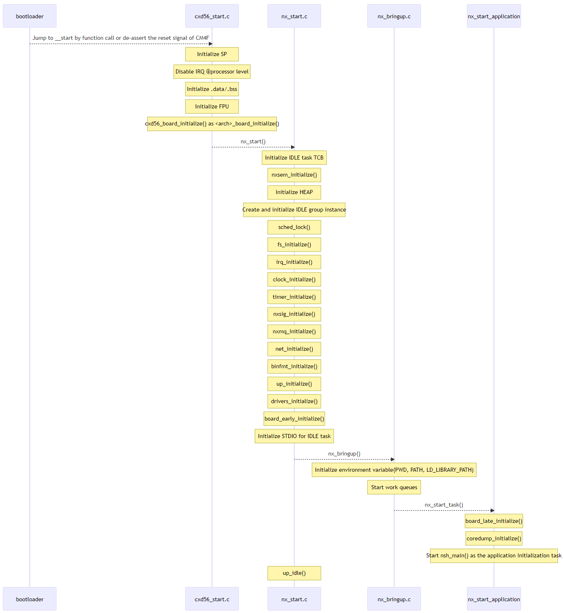

The diagram of boot sequence
============================

The premise of this sequence diagram is NuttX12.4.0, cxd56xx, non-SMP
and Flat build.

The beginning of boot sequence is \_\_start(). \_\_start() will call
nx\_start(). nx\_start() will initialize the kernel and call
nsh\_main(). nsh\_main() will execute NuttShell(NSH). nx\_start() is
NuttX standard function, but the behavior depends on some kernel
configurations. For example, the calling nsh\_main() is also
configurable. About related kernel configurations, see
\[[/guide\](]{.title-ref}/guide.md)s/port\_relatedkernelconfigrations\`.

