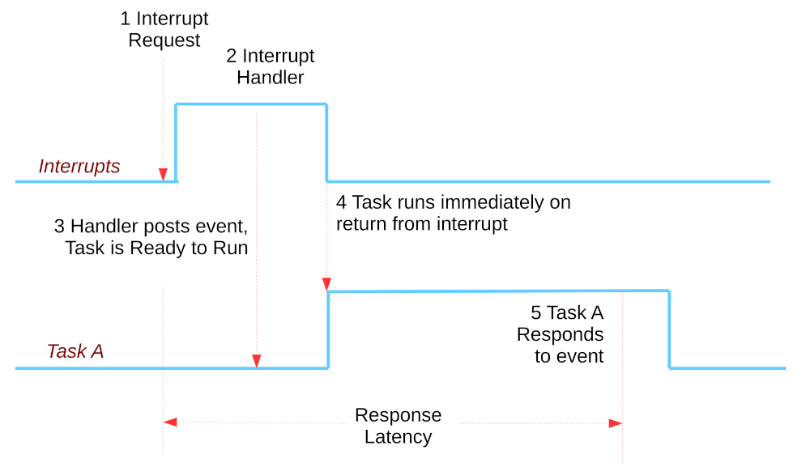
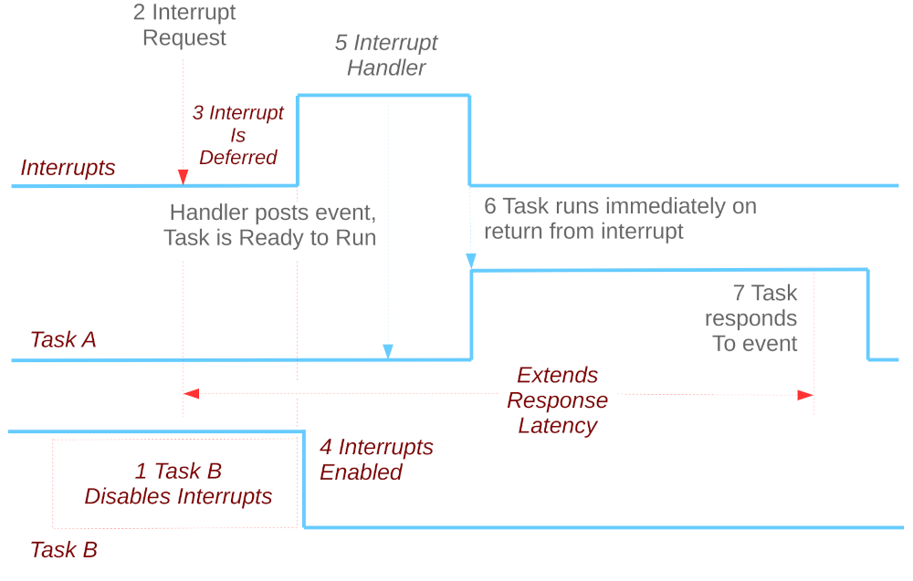
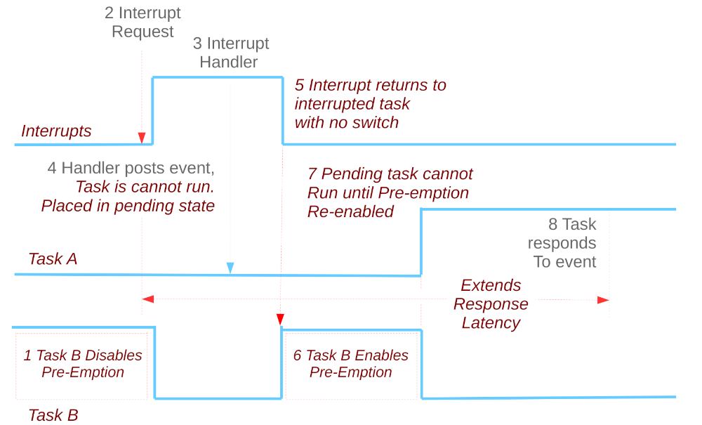

# Effects of Disabling Interrupts or Pre-Emption on Response Latency

## Rate Monotonic Scheduling

**Assumption**

> No resource sharing (processes do not share resources, e.g. a hardware
> resource, a queue, or any kind of semaphore blocking or non-blocking
> (busy-waits)).
> 
> Wikipedia “Rate Monotonic Scheduling”

**Real world**

We must protect shared resources with locks of some kind. The most
aggressive:

1.  Disabling interrupts, and
2.  Disabling pre-emption.

What are the effects of real-time performance when this assumptions is
violated?

### Normal Interrupt Processing

### Effect of Disabling Interrupts

### Effect of Disabling Pre-emption

