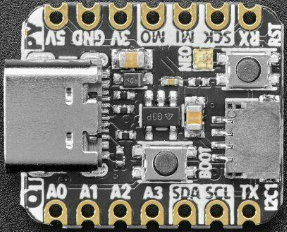

# Adafruit QT Py RP2040

<div class="tags">

chip:rp2040

</div>

The QT Py RP2040 is a tiny general purpose RP2040 board supplied by
Adafruit.



See the [Adafruit
website](https://learn.adafruit.com/adafruit-qt-py-2040/) for
information about the Adafruit QT Py RP2040.

## Features

  - RP2040 microcontroller chip
  - Dual-core ARM Cortex M0+ processor, flexible clock running up to 133
    MHz
  - 264kB of SRAM, and 8MB of on-board Flash memory
  - Castellated module allows soldering direct to carrier boards
  - USB Host and Device support via type C connector.
  - Low-power sleep and dormant modes
  - Drag & drop programming using mass storage over USB
  - 13 multi-function GPIO pins (11 breakout pads and two QT pads)
  - 2× SPI, 2× I2C, 2× UART, 4× 12-bit ADC, 16× controllable PWM
    channels
  - Accurate clock and timer on-chip
  - Temperature sensor
  - Accelerated floating point libraries on-chip
  - 8 × Programmable IO (PIO) state machines for custom peripheral
    support

## Serial Console

By default a serial console appears on GPIO pins 20 (RX GPIO1) and pin 5
(TX GPIO1). This console runs a 115200-8N1.

The board can be configured to use the USB connection as the serial
console.

## Buttons and LEDs

A ws2812 (NeoPixel) smart RGB LED controlled by GPIO12 (data) and GPIO11
(power).

There is a BOOT button which if held down when power is first applied or
the RESET button is pressed will cause the RP2040 to boot into program
mode and appear as a storage device to a USB connecter. Saving a .UF2
file to this device will replace the Flash ROM contents on the RP2040.

A RESET button that allows rebooting the board without disconnecting the
power.

## Pin Mapping

Pads numbered anticlockwise from USB connector.

| Pad       | Signal                  | Notes                               |
| --------- | ----------------------- | ----------------------------------- |
| 1         | GPIO26                  | ADC0                                |
| 2         | GPIO27                  | ADC1                                |
| 3         | GPIO28                  | ADC2                                |
| 4 5 6     | GPIO29 GPIO24 GPIO25    | ADC3                                |
| 7         | GPIO20                  | Default TX for UART1 serial console |
| 8 9 10 11 | GPIO5 GPIO6 GPIO4 GPIO3 | Default RX for UART1 serial console |
| 12 13 14  | 3.3V Ground 5V          | Power out to peripherals.           |

The board has a STEMMA QT connector that is also connected to pins
GPIO22 (I2C1 SDA) and GPIO23 (I2C1 SCL).

## Power Supply

The Raspberry Pi Pico can be powered via the USB connector, or by
supplying +5V to pin 14. The board had a diode that prevents power from
pin 14 from flowing back to the USB socket, although this can be
disabled by connecting on-board solder pads if there is need to run as a
usb host.

The Raspberry Pi Pico chip run on 3.3 volts which is supplied by an on
board regulator.

## Supported Capabilities

NuttX supports the following RP2040 capabilities:

  - UART (console port)
      - GPIO 0 (UART0 TX) and GPIO 1 (UART0 RX) are used for the
        console.
  - I2C
  - SPI (master only)
  - DMAC
  - PWM
  - ADC
  - Watchdog
  - USB device
      - MSC, CDC/ACM serial and these composite device are supported.
      - CDC/ACM serial device can be used for the console.
  - PIO (RP2040 Programmable I/O)
  - Flash ROM Boot
  - SRAM Boot
      - If Pico SDK is available, nuttx.uf2 file which can be used in
        BOOTSEL mode will be created.
  - Persistent flash filesystem in unused flash ROM
  - WiFi wireless communication

There is currently no direct user mode access to these RP2040 hardware
features:

  - SPI Slave Mode
  - SSI
  - RTC
  - Timers

NuttX also provide support for these external devices:

  - WS2812 smart pixel support

## Installation

1.  Download Raspberry Pi Pico SDK.

<!-- end list -->

``` console
 git clone -b 2.0.0 https://github.com/raspberrypi/pico-sdk.git
```

2.  Download and install picotool

> Instructions can be found here:
> <https://github.com/raspberrypi/picotool>
> 
> If you are on Arch Linux, you can install the picotool through the
> AUR:

``` console
 yay -S picotool
```

3.  Set PICO\_SDK\_PATH environment variable

<!-- end list -->

``` console
 export PICO_SDK_PATH=<absolute_path_to_pico-sdk_directory>
```

4.  Configure and build NuttX

<!-- end list -->

``` console
 git clone https://github.com/apache/nuttx.git nuttx
 git clone https://github.com/apache/nuttx-apps.git apps
 cd nuttx
 make distclean
 ./tools/configure.sh adafruit-qt-py-rp2040:nsh
 make V=1
```

5.  Connect the Adafruit QT Py RP2040 board to USB port while pressing
    BOOT. The board will be detected as USB Mass Storage Device. Then
    copy "nuttx.uf2" into the device (Same manner as the standard Pico
    SDK applications installation).

6.  To access the console, GPIO 20 (TX) and GPIO 5 (RX) pins must be
    connected to the device such as USB-serial converter.
    
    <span class="title-ref">usbnsh</span> configuration provides the
    console access by USB CDC/ACM serial decive. The console is
    available by using a terminal software on the USB host.

## Configurations

### gpio

NuttShell configuration (console enabled in UART1, at 115200 bps) with
GPIO examples.

### nsh

Basic NuttShell configuration (console enabled in UART1, at 115200 bps).

### nsh-flash

Basic NuttShell configuration (console enabled in UART0, at 115200 bps
with SMART flash filesystem.

### nshsram

NuttShell configuration (console enabled in UART1, at 115200 bps) with
interrupt vectors in RAM.

### smp

Basic NuttShell configuration (console enabled in UART1, at 115200 bps)
with both ARM cores enabled.

### usbnsh

Basic NuttShell configuration using CDC/ACM serial (console enabled in
USB Port, at 115200 bps).

## License exceptions

The following files are originated from the files in Pico SDK. So, the
files are licensed under 3-Clause BSD same as Pico SDK.

  - arch/arm/src/rp2040/rp2040\_clock.c
  - arch/arm/src/rp2040/rp2040\_pll.c
  - arch/arm/src/rp2040/rp2040\_xosc.c
      - These are created by referring the Pico SDK clock
        initialization.
  - arch/arm/src/rp2040/rp2040\_pio.c
  - arch/arm/src/rp2040/rp2040\_pio.h
  - arch/arm/src/rp2040/rp2040\_pio\_instructions.h
      - These provide the similar APIs to Pico SDK's hardware\_pio APIs.
  - arch/arm/src/rp2040/hardware/\*.h
      - These are generated from rp2040.svd originally provided in Pico
        SDK.
