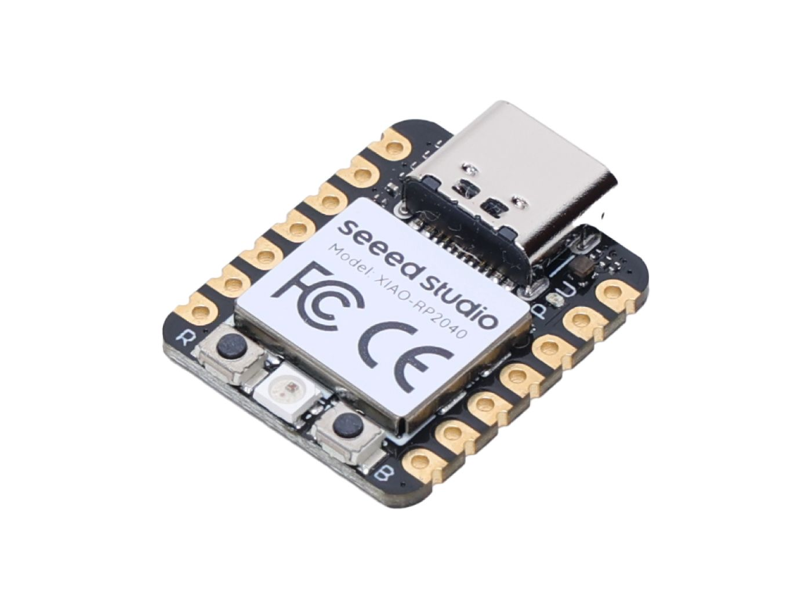

Seeed Studio XIAO RP2040
========================

chip:rp2040

The [Seeed Studio Xiao
RP2040](https://wiki.seeedstudio.com/XIAO-RP2040/) is a general purpose
board supplied by Seeed Studio and it is compatible with the Raspberry
Pi RP2040 ecosystem as they share the same RP2040 chip.

{.align-center}

Features
--------

-   RP2040 microcontroller chip
-   Dual-core ARM Cortex M0+ processor, flexible clock running up to 133
    MHz
-   264KB of SRAM, and 2MB of onboard Flash memory
-   11 digital pins, 4 analog pins, 11 PWM Pins
-   1 I2C interface, 1 UART interface, 1 SPI interface, 1 SWD Bonding
    pad interface
-   USB Type-C interface
-   1 user LED, 1 power LED, two LEDs for serial port downloading, 1 RGB
    LED
-   1 RESET button, 1 BOOT button

Serial Console
--------------

By default a serial console appears on pins 6 (TX GPIO0) and pin 7 (RX
GPIO1). This console runs a 115200-8N1. The board can be configured to
use the USB connection as the serial console.

LEDs
----

There are 2 LEDs available for user:

-   A RGB LED connected to GPIO16 (PIN\_LED\_G), GPIO17 (PIN\_LED\_R),
    GPIO25 (PIN\_LED\_B).
-   A NeoPixel RGB LED connected to GPIO11 (NEOPIXEL\_POWER) and GPIO12
    (PIN\_NEOPIXEL).

Buttons
-------

There are 2 buttons available:

A RESET button and a BOOT button, which if held down when power is first
applied to the board, will cause the RP2040 to boot into programming
mode and appear as a storage device to a computer connected via USB.
Saving a .UF2 file to this device will replace the Flash ROM contents on
the RP2040.

Pin Mapping
-----------

Pads numbered anticlockwise from USB connector.

  Pad     Signal       Notes
  ------- ------------ -----------------------------------------
  0       GPI26        D0/A0
  1       GPI27        D1/A1
  2       GPI28        D2/A2
  3       GPI29        D3/A3
  4       GPIO6        D4/SDA
  5       GPIO7        D5/SCL
  6       GPIO0        Default TX for UART0 serial console
  7       GPIO1        Default RX for UART1 serial console/CSn
  8       GPIO2        D8/SCK
  9       GPIO3        D10/MOSI
  10      GPIO4        D9/MicroSD
  11 12   3V3 Ground   Power output to peripherals
  13      VIN          +5V Supply to board

Power Supply
------------

For general I/O pins:

Working voltage of MCU is 3.3V. Voltage input connected to general I/O
pins may cause chip damage if it\' higher than 3.3V.

For power supply pins:

The built-in DC-DC converter circuit able to change 5V voltage into 3.3V
allows to power the device with a 5V supply via VIN-PIN and via the USB
connector.

Installation
------------

1.  Download Raspberry Pi Pico SDK.

``` {.console}
 git clone -b 2.0.0 https://github.com/raspberrypi/pico-sdk.git
```

2.  Download and install picotool

> Instructions can be found here:
> <https://github.com/raspberrypi/picotool>
>
> If you are on Arch Linux, you can install the picotool through the
> AUR:

``` {.console}
 yay -S picotool
```

3.  Set PICO\_SDK\_PATH environment variable

``` {.console}
 export PICO_SDK_PATH=<absolute_path_to_pico-sdk_directory>
```

4.  Configure and build NuttX

``` {.console}
 git clone https://github.com/apache/nuttx.git nuttx
 git clone https://github.com/apache/nuttx-apps.git apps
 cd nuttx
 make distclean
 ./tools/configure.sh seeed-xiao-rp2040:nsh
 make V=1
```

5.  Connect the Seeed Studio Xiao RP2040 board to USB port while
    pressing BOOTSEL (small button marked \"B\"). The board will be
    detected as USB Mass Storage Device. Then copy \"nuttx.uf2\" into
    the device. (Same manner as the standard Pico SDK applications
    installation)

6.  To access the console, GPIO 0 and 1 pins must be connected to the
    device such as USB-serial converter.

    [usbnsh]{.title-ref} configuration provides the console access by
    USB CDC/ACM serial device. The console is available by using a
    terminal software on the USB host.

Configurations
--------------

### nsh

Basic NuttShell configuration (console enabled in UART0, at 115200 bps).

### userled

This is an nsh configuration with added support for user LEDs.

### usbnsh

Basic NuttShell configuration using CDC/ACM serial (console enabled in
USB Port, at 115200 bps).

License exceptions
------------------

The following files are originated from the files in Pico SDK. So, the
files are licensed under 3-Clause BSD same as Pico SDK.

-   arch/arm/src/rp2040/rp2040\_clock.c
-   arch/arm/src/rp2040/rp2040\_pll.c
-   arch/arm/src/rp2040/rp2040\_xosc.c
    -   These are created by referring the Pico SDK clock
        initialization.
-   arch/arm/src/rp2040/rp2040\_pio.c
-   arch/arm/src/rp2040/rp2040\_pio.h
-   arch/arm/src/rp2040/rp2040\_pio\_instructions.h
    -   These provide the similar APIs to Pico SDK\'s hardware\_pio
        APIs.
-   arch/arm/src/rp2040/hardware/\*.h
    -   These are generated from rp2040.svd originally provided in Pico
        SDK.
