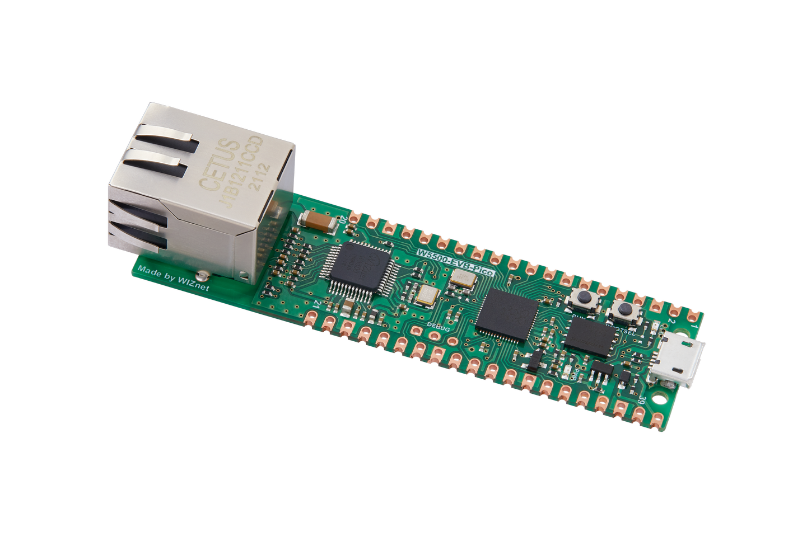

# W5500-EVB-Pico

chip:rp2040, ethernet

The
[W5500-EVB-Pico](https://docs.wiznet.io/Product/iEthernet/W5500/w5500-evb-pico/)
is a microcontroller evaluation board based on the Raspberry Pi RP2040
and fully hardwired TCP/IP controller W5500 – and basically works the
same as Raspberry Pi Pico board but with additional Ethernet via W5500.

## Features

  - RP2040 microcontroller chip
  - Dual-core ARM Cortex M0+ processor, flexible clock running up to 133
    MHz
  - 264kB of SRAM, and 2MB of on-board Flash memory
  - Castellated module allows soldering direct to carrier boards
  - USB 1.1 Host and Device support
  - Low-power sleep and dormant modes
  - Drag & drop programming using mass storage over USB
  - 26 multi-function GPIO pins
  - 2× SPI, 2× I2C, 2× UART, 3× 12-bit ADC, 16× controllable PWM
    channels
  - Accurate clock and timer on-chip
  - Temperature sensor
  - Accelerated floating point libraries on-chip
  - 8 × Programmable IO (PIO) state machines for custom peripheral
    support
  - Ethernet port via WIZnet W5500, hardwired to SPI0 and two GPIO pins.

## Supported RP2040 capabilities

  - UART (console port)
      - GPIO 0 (UART0 TX) and GPIO 1 (UART0 RX) are used for the
        console.
  - I2C
  - SPI (master only)
  - DMAC
  - PWM
  - ADC
  - Watchdog
  - USB device
      - MSC, CDC/ACM serial and these composite device are supported.
      - CDC/ACM serial device can be used for the console.
  - PIO (RP2040 Programmable I/O)
  - Flash ROM Boot
  - SRAM Boot
      - If Pico SDK is available, nuttx.uf2 file which can be used in
        BOOTSEL mode will be created.
      - Persistent flash filesystem in unused flash ROM

## Currently unsupported RP2040 capabilities

  - SPI Slave Mode
  - SSI
  - RTC
  - Timers

## Serial Console

The board is configured to use the USB connection as the serial console.

## Buttons and LEDs

User LED controlled by GPIO25.

A BOOTSEL button, which if held down when power is first applied to the
board, will cause the RP2040 to boot into programming mode and appear as
a storage device to a computer connected via USB. Saving a .UF2 file to
this device will replace the Flash ROM contents on the RP2040.

## Pin Mapping

Pads numbered anticlockwise from USB connector.

| Pad                                              | Signal                                                                                                                      | Notes                               |
| ------------------------------------------------ | --------------------------------------------------------------------------------------------------------------------------- | ----------------------------------- |
| 1                                                | GPIO0                                                                                                                       | Default TX for UART0 serial console |
| 2 3 4 5 6 7 8 9 10 11 12 13 14 15 16 17 18 19 20 | GPIO1 Ground GPIO2 GPIO3 GPIO4 GPIO5 Ground GPIO6 GPIO7 GPIO8 GPIO9 Ground GPIO10 GPIO11 GPIO12 GPIO13 Ground GPIO14 GPIO15 | Default RX for UART1 serial console |
| 21                                               | GPIO16                                                                                                                      | W5500 MISO                          |
| 22 23                                            | GPIO17 Ground                                                                                                               | W5500 CSn                           |
| 24                                               | GPIO18                                                                                                                      | W5500 SCLK                          |
| 25                                               | GPIO19                                                                                                                      | W5500 MOSI                          |
| 26                                               | GPIO20                                                                                                                      | W5500 RSTn                          |
| 27 28 29 30                                      | GPIO21 Ground GPIO22 Run                                                                                                    | W5500 INTn                          |
| 31                                               | GPIO26                                                                                                                      | ADC0                                |
| 32                                               | GPIO27                                                                                                                      | ADC1                                |
| 33                                               | AGND                                                                                                                        | Analog Ground                       |
| 34 35                                            | GPIO28 ADC\_VREF                                                                                                            | ADC2                                |
| 36                                               | 3V3                                                                                                                         | Power output to peripherals         |
| 37 38                                            | 3V3\_EN Ground                                                                                                              | Pull to ground to turn off.         |
| 39                                               | VSYS                                                                                                                        | \+5V Supply to board                |
| 40                                               | VBUS                                                                                                                        | Connected to USB +5V                |

## Other RP2040 Pins

| Signal | Notes                                                      |
| ------ | ---------------------------------------------------------- |
| GPIO23 | Output - Power supply control.                             |
| GPIO24 | Input - High if USB port or Pad 40 supplying power.        |
| GPIO25 | Output - On board LED.                                     |
| ADC3   | Input - Analog voltage equal to one third of VSys voltage. |

Separate pins for the Serial Debug Port (SDB) are available

## Power Supply

The W5500-EVB-Pico can be powered via the USB connector, or by supplying
+5V to pin 39. The board had a diode that prevents power from pin 39
from flowing back to the USB socket, although the socket can be power
via pin 30.

The W5500-EVB-Pico chip run on 3.3 volts. This is supplied by an onboard
voltage regulator. This regulator can be disabled by pulling pin 37 to
ground.

The regulator can run in two modes. By default the regulator runs in PFM
mode which provides the best efficiency, but may be switched to PWM mode
for improved ripple by outputting a one on GPIO23.

## Installation

1.  Download Raspberry Pi Pico SDK

<!-- end list -->

     git clone -b 2.0.0 https://github.com/raspberrypi/pico-sdk.git

2.  Set PICO\_SDK\_PATH environment variable

<!-- end list -->

     export PICO_SDK_PATH=<absolute_path_to_pico-sdk_directory>

3.  Configure and build NuttX

<!-- end list -->

     git clone https://github.com/apache/nuttx.git nuttx
     git clone https://github.com/apache/nuttx-apps.git apps
     cd nuttx
     make distclean
     ./tools/configure.sh w5500-evb-pico:usbnsh
     make V=1

4.  Connect W5500-EVB-Pico board to USB port while pressing BOOTSEL. The
    board will be detected as USB Mass Storage Device. Then copy
    "nuttx.uf2" into the device. (Same manner as the standard Pico SDK
    applications installation.)
5.  usbnsh configuration provides the
    console access by USB CDC/ACM serial devcice. The console is
    available by using a terminal software on the USB host.

## Configurations

### usbnsh

USB CDC/ACM serial console with NuttShell. TCP/IPv4 & IPv6 networking is
supported via the Ethernet port.

## License exceptions

The following files are originated from the files in Pico SDK. So, the
files are licensed under 3-Clause BSD same as Pico SDK.

### Created by referring to the Pico SDK clock initialization

  - arch/arm/src/rp2040/rp2040\_clock.c
  - arch/arm/src/rp2040/rp2040\_pll.c
  - arch/arm/src/rp2040/rp2040\_xosc.c

### Providing an API similar to the Pico SDK's hardware\_pio API

  - arch/arm/src/rp2040/rp2040\_pio.c
  - arch/arm/src/rp2040/rp2040\_pio.h
  - arch/arm/src/rp2040/rp2040\_pio\_instructions.h

### Generated from rp2040.svd originally provided in Pico SDK

  - arch/arm/src/rp2040/hardware/\*.h
