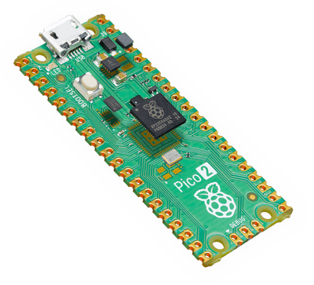

# Raspberry Pi Pico 2

chip:rp2350

The [Raspberry Pi
Pico 2](https://www.raspberrypi.com/products/raspberry-pi-pico-2/) is a
general purpose board supplied by the Raspberry Pi Foundation.

## Features

  - RP2350 microcontroller chip
  - Dual-core ARM Cortex M33 processor, flexible clock running up to 150
    MHz
  - 520kB of SRAM, and 4MB of on-board Flash memory
  - Castellated module allows soldering direct to carrier boards
  - USB 1.1 Host and Device support
  - Low-power sleep and dormant modes
  - Drag & drop programming using mass storage over USB
  - 26 multi-function GPIO pins
  - 2× SPI, 2× I2C, 2× UART, 3× 12-bit ADC, 16× controllable PWM
    channels
  - Accurate clock and timer on-chip
  - Temperature sensor
  - Accelerated floating point libraries on-chip
  - 12 × Programmable IO (PIO) state machines for custom peripheral
    support

## Serial Console

By default a serial console appears on pins 1 (TX GPIO0) and pin 2 (RX
GPIO1). This console runs a 115200-8N1.

The board can be configured to use the USB connection as the serial
console. See the usbnsh configuration.

## Buttons and LEDs

User LED controlled by GPIO25 and is configured as autoled by default.

A BOOTSEL button, which if held down when power is first applied to the
board, will cause the RP2350 to boot into programming mode and appear as
a storage device to the computer connected via USB. Saving a .UF2 file
to this device will replace the Flash ROM contents on the RP2350.

## Pin Mapping

Pads numbered anticlockwise from USB connector.

| Pad                                                                            | Signal                                                                                                                                                                                         | Notes                               |
| ------------------------------------------------------------------------------ | ---------------------------------------------------------------------------------------------------------------------------------------------------------------------------------------------- | ----------------------------------- |
| 1                                                                              | GPIO0                                                                                                                                                                                          | Default TX for UART0 serial console |
| 2 3 4 5 6 7 8 9 10 11 12 13 14 15 16 17 18 19 20 21 22 23 24 25 26 27 28 29 30 | GPIO1 Ground GPIO2 GPIO3 GPIO4 GPIO5 Ground GPIO6 GPIO7 GPIO8 GPIO9 Ground GPIO10 GPIO11 GPIO12 GPIO13 Ground GPIO14 GPIO15 GPIO16 GPIO17 Ground GPIO18 GPIO19 GPIO20 GPIO21 Ground GPIO22 Run | Default RX for UART1 serial console |
| 31                                                                             | GPIO26                                                                                                                                                                                         | ADC0                                |
| 32                                                                             | GPIO27                                                                                                                                                                                         | ADC1                                |
| 33                                                                             | AGND                                                                                                                                                                                           | Analog Ground                       |
| 34 35                                                                          | GPIO28 ADC\_VREF                                                                                                                                                                               | ADC2                                |
| 36                                                                             | 3V3                                                                                                                                                                                            | Power output to peripherals         |
| 37 38                                                                          | 3V3\_EN Ground                                                                                                                                                                                 | Pull to ground to turn off.         |
| 39                                                                             | VSYS                                                                                                                                                                                           | \+5V Supply to board                |
| 40                                                                             | VBUS                                                                                                                                                                                           | Connected to USB +5V                |

## Other RP2350 Pins

GPIO23 Output - Power supply control. GPIO24 Input - High if USB port or
Pad 40 supplying power. GPIO25 Output - On board LED. ADC3 Input -
Analog voltage equal to one third of VSys voltage.

Separate pins for the Serial Debug Port (SDB) are available

## Power Supply

The Raspberry Pi Pico 2 can be powered via the USB connector, or by
supplying +5V to pin 39. The board had a diode that prevents power from
pin 39 from flowing back to the USB socket, although the socket can be
power via pin 30.

The Raspberry Pi Pico chip run on 3.3 volts. This is supplied by an
onboard voltage regulator. This regulator can be disabled by pulling pin
37 to ground.

The regulator can run in two modes. By default the regulator runs in PFM
mode which provides the best efficiency, but may be switched to PWM mode
for improved ripple by outputting a one on GPIO23.

## Configurations

### nsh

Basic NuttShell configuration (console enabled in UART0, at 115200 bps).

## README.txt
