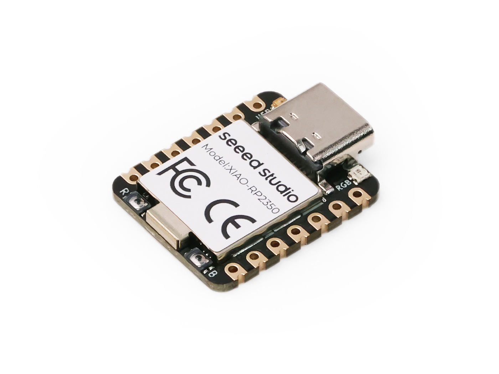

Seeed Studio XIAO RP2350
========================

chip:rp2350

The [Seeed Studio XIAO
RP2350](https://wiki.seeedstudio.com/getting-started-xiao-rp2350/) is a
general purpose board supplied by Seeed Studio and it is compatible with
the Rapiberry RP2350 ecosystem, sharing the same MCU as Rapiberry Pi
Pico 2.

{.align-center}

Features
--------

-   Raspberry Pi RP2350, ARM® Dual Cortex-M33 @ 150MHz, FPU
-   520kB SRAM, 2MB Flash
-   Security: OTP, Secure Boot, Arm TrustZone
-   USB Type-C interface
-   19 Pins:3x Analog,19x Digital, 2x I²C, 2x UART, 2x SPI, All PWM
-   1 user LED, 1 power LED，1 RGB LED (WS2812)
-   1 RESET button, 1 BOOT button

Serial Console
--------------

By default, a serial console appears on pins 6 (TX GPIO) and pin 7 (RX
GPIO). This console runs a 115200-8N1. The board can be configured to
use the USB connection as the serial console.

User LED
--------

The USER LED, the yellow LED on the XIAO RP2350, is connected to
GPIO25/D19 according to the schematic diagram. The USER LED will light
up when set to a low level and turn off when set to a high level.

Buttons
-------

The RESET and BOOT buttons can be used to enter bootloader mode by press
and hold BOOT buttons and then press and release RESET button. Then, the
board will enumerate as a storage device to a computer connected via
USB. Saving a .UF2 file to this device will replace the Flash ROM
contents on the RP2350.

Pin Mapping
-----------

Pads numbered anticlockwise from USB connector.

  Pad     Signal       Notes
  ------- ------------ ----------------------------------------
  0       GPIO26       D0/A0
  1       GPIO27       D1/A1
  2       GPIO28       D2/A2
  3       GPIO5        D3/A3
  4       GPIO6        D4/SDA
  5       GPIO7        D5/SCL
  6       GPIO0        D6/Default TX for UART0 serial console
  7       GPIO1        D7/Default RX for UART0 serial console
  8       GPIO2        D8/SCK
  9       GPIO4        D9/MISO
  10      GPIO3        D10/MOSI
  11 12   3V3 Ground   Power output to peripherals
  13      VIN          +5V Supply to board

Power Supply
------------

The working voltage of the MCU is 3.3V. Voltage input connected to
general I/O pins may cause chip damage if it's higher than 3.3V.

Installation
------------

1.  Configure and build NuttX:

``` {.console}
 git clone https://github.com/apache/nuttx.git nuttx
 git clone https://github.com/apache/nuttx-apps.git apps
 cd nuttx
 make distclean
 ./tools/configure.sh xiao-rp2350:nsh
 make V=1
```

2\. Connect the Seeed Studio XIAO RP2350, and enter bootloader mode,
once the board is detected as a USB Mass Storage Device, copy
"nuttx.uf2" into the device.

3.  To access the console, TX and RX pins must be connected to the
    device such as USB-serial converter.

Configurations
--------------

### nsh

Basic NuttShell configuration (console enabled in UART0, at 115200 bps).

### usbnsh

Basic NuttShell configuration using CDC/ACM serial (console enabled in
USB Port, at 115200 bps).

### combo

This configuration enabled NuttShell via Serial and enabled led, gpio
and ws2812 examples:

Testing leds:

``` {.console}
nsh> leds
leds_main: Starting the led_daemon
leds_main: led_daemon started

led_daemon (pid# 3): Running
led_daemon: Opening /dev/userleds
led_daemon: Supported LEDs 0x01
led_daemon: LED set 0x01
nsh> led_daemon: LED set 0x00
led_daemon: LED set 0x01
led_daemon: LED set 0x00
led_daemon: LED set 0x01
led_daemon: LED set 0x00
```

Testing gpios:

  PIN/GPIO   Mode     Device
  ---------- -------- ------------
  D0/P0.02   Input    /dev/gpio0
  D2/P0.28   Output   /dev/gpio1
  D1/P0.03   Input    /dev/gpio2

``` {.console}
nsh> gpio -w 1 /dev/gpio26
Driver: /dev/gpio26
  Interrupt pin: Value=0
  Verify:        Value=0
nsh> gpio /dev/gpio27
Driver: /dev/gpio27
  Input pin:     Value=0
nsh> gpio /dev/gpio27
Driver: /dev/gpio27
  Input pin:     Value=1
nsh> gpio -o 1 /dev/gpio28
Driver: /dev/gpio28
  Output pin:    Value=0
  Writing:       Value=1
  Verify:        Value=1
nsh> gpio -o 0 /dev/gpio28
Driver: /dev/gpio28
  Output pin:    Value=1
  Writing:       Value=0
  Verify:        Value=0
```

Testing ws2812:

``` {.console}
nsh> ws2812
```
