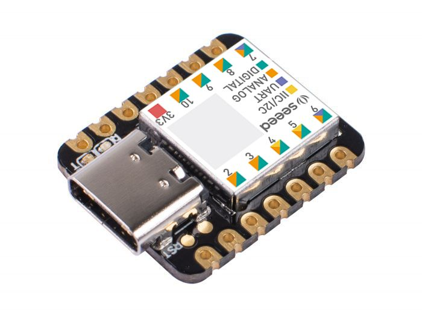

Seeed Studio XIAO SAMD21
========================

The [Seeed Studio Xiao
SAM21](https://wiki.seeedstudio.com/Seeeduino-XIAO/) is the first of the
XIAO family, and is a general purpose, low-power and tiny board. It can
be referred to as the \"Seeed Studio Xiao SAMD21\" or the \"Xiao
Seeeduino\".

{.align-center}

Features
--------

-   ATSAMD21G18A-MU microcontroller chip \@48MHz
-   256KB flash
-   32KB SRAM
-   14 pins (11 analog, 11 digital)
-   10 PWM interfaces
-   1 DAC output pin
-   Serial wire debug interface
-   1 I2C interface
-   1 SPI interface
-   1 UART interface
-   USBC interface
-   Serial communication indicator LEDs for TX and RX (blue)
-   Power indicator LED (green)
-   Blinkable LED (yellow)

Serial Console
--------------

By default, the serial console appears on the board\'s UART interface.
Pin 9 is TX and pin 7 is RX.

Pin Mapping
-----------

Pins are numbered anticlockwise from the USB connector.

  Pin        Signal        Notes
  ---------- ------------- ------------------------------------------
  0          PA2           A0/D0/DAC
  1          PA4           A1/D1
  2          PA10          A2/D2
  3          PA11          A3/D3
  4          PA8           A4/D4/SDA (I2C)
  5          PA9           A5/D5/SCL (I2C)
  6          PB08          A6/D6/TX (UART)
  7          PB09          A7/D7/RX (UART)
  8          PA7           A8/D8/SCK (SPI)
  9          PA5           A9/D9/MISO (SPI)
  10 11 12   PA6 3V3 GND   A10/D10/MOSI (SPI)
  13         5V            You can supply 5V power on this pin too.

There are also four pads on the back side of the board. SWCLK, SWDIO for
serial wire debugging, and RST and GND for resetting the board. These
same two pins are also exposed on the top of the board.

Power Supply
------------

The board can be powered through a USB-C connection. It can also be
supplied 5V power through it\'s 5V power pin.

There is an additional two pads for powering the board (VIN and GND) on
the back side. The board accepts anywhere between 3.3V and 5V.

Installation
------------

To build NuttX for the Xiao Seeduino, you can use the following
configuration commands within the cloned `nuttx` repository:

``` {.console}
 ./tools/configure.sh xiao-seeeduino:nsh
 make
```

This will generate a `nuttx.hex` file. To put the program on your board,
you can choose from one of the following:

1.  Convert the hex file to a uf2 file using the [Microsoft uf2
    tool](https://github.com/microsoft/uf2/):

    ``` {.console}
     git clone https://github.com/microsoft/uf2.git
     cd uf2/utils
     python uf2conv.py -f 0x68ed2b88 -b 0x2000 nuttx.hex -o nuttx.uf2
    ```

    Then, plug your board into the host computer using the USB-C
    interface. Short the RST (reset) pad with ground twice in a row
    quickly. The board will be detected as mass storage under the name
    \"Arduino\", and its orange LED will be pulsing slowly. You can then
    copy the UF2 file to the drive/storage device which appears. Once
    the file is done copying, the board will auto-eject and you will
    have an NSH console on the UART pins!

    Maybe this process should be part of the post-build scripts, since
    the Microsoft UF2 tools is MIT licensed.

2.  Flash the hex file using the `bossac` tool. You can find the source
    for it [here](https://github.com/shumatech/BOSSA/), or you can
    install it on Arch Linux via the AUR with this command:

    ``` {.console}
     yay -S bossa
    ```

    Then, plug your Seeduino in via USB-C to the host computer and short
    the RST (reset) and ground pins twice in a row quickly. The board
    will be detected as mass storage under the name \"Arduino\", and its
    orange LED should be pulsing. You can then run the following
    command:

    ``` {.console}
     sudo stty -F <path/to/xiao-USB-port> 1200
     sudo bossac -i -d --port=<path/to/xiao-USB-port> -i -w -v nuttx.hex -R
    ```

    The `bossac` utility doesn\'t actually work for programming in my
    testing yet. It is what the Arduino IDE uses but I haven\'t managed
    to get the command line working. Using the commands listed above
    does actually detect the board but the programming itself fails with
    \"Flash command failed\". This needs more debugging.

Configurations
--------------

### nsh

Basic NuttShell configuration with the console enabled on the UART
interface at 115200 bps. Comes with \"Hello world\" demo.
