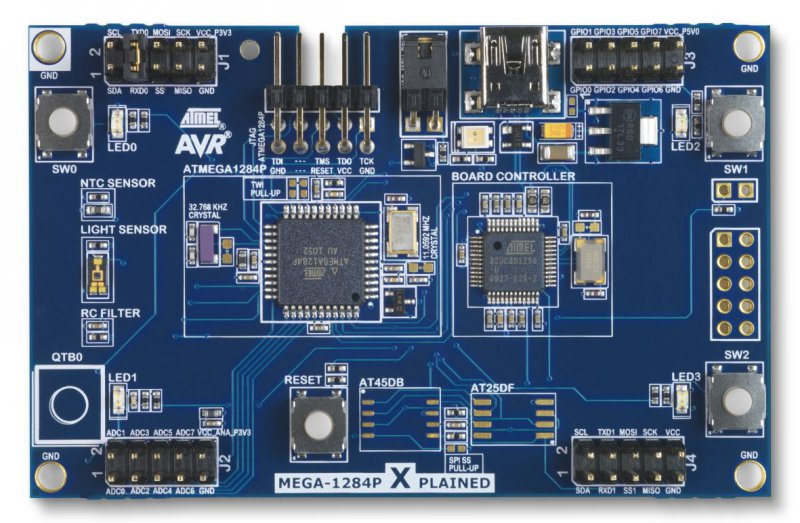

Atmega MEGA1284P-XPLAINED
=========================

The
[MEGA1284P-XPLAINED](https://www.microchip.com/en-us/development-tool/ATMEGA1284P-XPLD)
is a development board for the Atmega1284P from Microchip/Atmel.

{.align-center}

Features
--------

> -   Atmega1284P MCU, 128K FLASH, 16K SRAM
> -   11.0592 MHz crystal
> -   32768 Hz crystal
> -   Embedded AVR911 compatible programmer
> -   Reset button
> -   4 user buttons (3 switch and 1 touch button)
> -   4 LEDs indicator (connected to PWM pins)
> -   Light sensor
> -   NTC sensor
> -   Not populated external SPI Flash with labels: AT45DB and AT25DF
> -   Power indicator LED

Pin Mapping
-----------

  Pin                 Signal                      Notes
  ------------------- --------------------------- ------------
  P0.24               Blue LED                    Active LOW
  P0.23               Red LED                     Active LOW
  P0.22 P0.20 P0.19   Green LED UART TX UART RX   Active LOW

Configurations
--------------

### nsh

Basic NuttShell configuration (console enabled in USART0, pins PD0
(RXD0) and PD1 (TXD0), at 115200 bps).

Flash & Debug
-------------

You can flash the board using avrdure. First press and hold SW0 button,
then press and release RESET button, after 1 second release the SW0
button. Now run the command:

     avrdude -p atmega1284p -c avr910 -P /dev/ttyACM0 -b57600 -F -u -U flash:w:nuttx.hex:i
