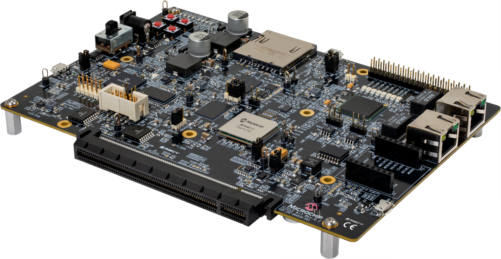

# PolarFire SoC Icicle Kit

|                 |
| --------------- |
|  |

## CPU

PolarFire SoC FPGA (MPFS250T-FCVG484EES)

  - SiFive E51 Monitor core (1 x RV64IMAC)
  - SiFive U54 Application cores (4 x RV64GC)
  - and Secure boot

## Memory and storage

  - 2 GB LPDDR4 x 32
  - 1 Gb SPI flash
  - 8 GB eMMC flash & SD card slot (multiplexed)

## Programming & Debugging

Onboard JTAG connector or onboard embedded FlashPro (multiplexed)

  - UART via micro USB
  - 52 x test points

## Interfaces

  - 4 x 12.7 Gbps SERDES
  - PCIe Gen2 Rootport
  - 2 x Gigabit Ethernet
  - Micro USB 2.0 Hi-Speed OTG
  - 4 x UART (via single micro USB)
  - 2 x CAN
  - 2 x SPI
  - 2 x I²C

## Expansion

  - Raspberry Pi compatible 40-pin header
  - mikroBUS socket

## Sensor

  - Power sensor (pac1934)

### Buttons and LEDs

## Buttons

There are 3 buttons and reset button. The Reset button is not available
to software by default.

## LEDs

There is 4 user controlled on-board LEDs.

### Configurations

## nsh

Basic configuration to run the NuttShell (nsh).

hwtest ---

Configuration to run the NuttShell (nsh) and enabling the peripherals.

The following peripherals are configured: - I2C0 & I2C1 - Ethernet on
MAC 1, configured to 1Gbit speed - USB (high speed) + CDCACM - SDCard -
SPI0 & SPI1 - UART0-4 - CorePWM (nb. needs the FPGA IP installed to
work) - CoreSPI (nb. needs the FPGA IP installed to work)

The following applications are available: - TelnetD (at address
10.0.0.2) - tcpblaster & udpblaster - ostest
