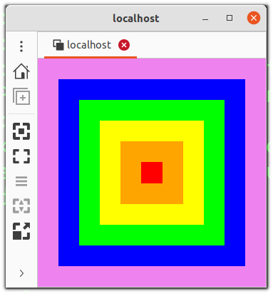

SIM
===

It is possible to run NuttX in a simulator called `sim`, but some
features currently are supported only on Linux host (i.e.: Bluetooth,
I2C, SPI, etc).

Using `sim` you can test many of NuttX features without a supported
board. Examples of supported features: Audio, Bluetooth, ELF, I2C, SPI,
LVGL, Flash File System, NX Serves, NX Demos, NX Window Manager, ROMFS,
Network: TCP, UDP, IP,6LoWPAN, and many more.

Toolchain
---------

All you need is your machine `gcc` working.

Compiling
---------

All you need to do is select your desired board profile configuration
(see: nuttx/sim/sim/sim/configs for the listing) :

     make distclean

     ./tools/configure.sh sim:nsh

     make

Running
-------

When the compilation finishes it will create a `nuttx` binary, then run
it:

     ./nuttx 
    login: admin
    password: Administrator
    User Logged-in!

    NuttShell (NSH) NuttX-10.1.0
    MOTD: username=admin password=Administrator
    nsh> ?
    help usage:  help [-v] [<cmd>]

      .         cd        echo      hexdump   mkfatfs   pwd       source    unset     
      [         cp        exec      kill      mkrd      readlink  test      usleep    
      ?         cmp       exit      losetup   mount     rm        time      xd        
      basename  dirname   false     ln        mv        rmdir     true      
      break     dd        free      ls        poweroff  set       uname     
      cat       df        help      mkdir     ps        sleep     umount    

    Builtin Apps:
      sh     hello  nsh    
    nsh> uname -a
    NuttX 10.1.0 508215581f Sep  3 2021 10:47:34 sim sim
    nsh>

Running LVGL
------------

It is possible to run the LVGL Demo directly in the NuttX simulator :

     make distclean

     ./tools/configure.sh sim:lvgl_fb

     make -j

     ./nuttx

You should see a window with the touch calibration and then the LVGL
demo:

{.align-center width="100.0%"}

Running VNC Server
------------------

NuttX supports a VNC server, so it means even boards without a LCD
display could export a display interface over network. Also you can test
it on NuttX simulator before getting it working on your board, just
follow these steps :

     make distclean

     ./tools/configure.sh sim:vncserver

     make -j

     ./nuttx

Open a new terminal and execute :

     remmina -c vnc://localhost

You should see some squares in different colors displayed in remmina:

{.align-center
width="100.0%"}

Running Simulated CAN
---------------------

The simulator supports CAN support via SocketCAN on the host. The CAN
interface of the host must be properly configured:

    ip link set can0 type can bitrate 1000000
    ip link set can0 up

Virtual CAN interface can be used as well:

    ip link add dev can0 type vcan
    ifconfig can0 up

Supported Boards
----------------

> boards/*/*
