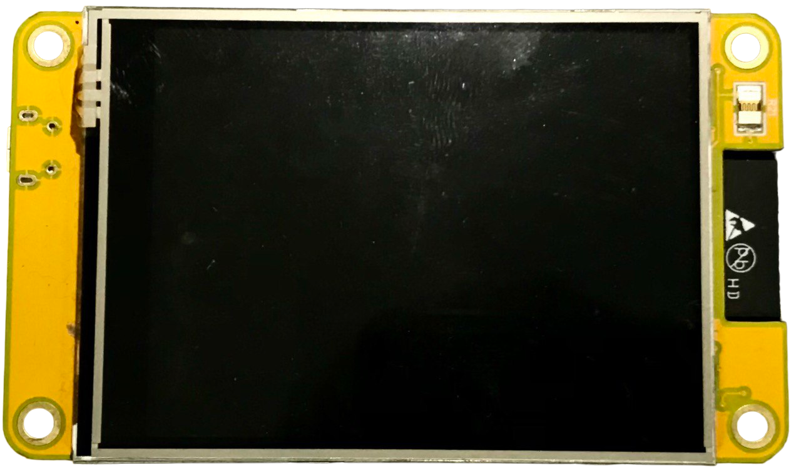
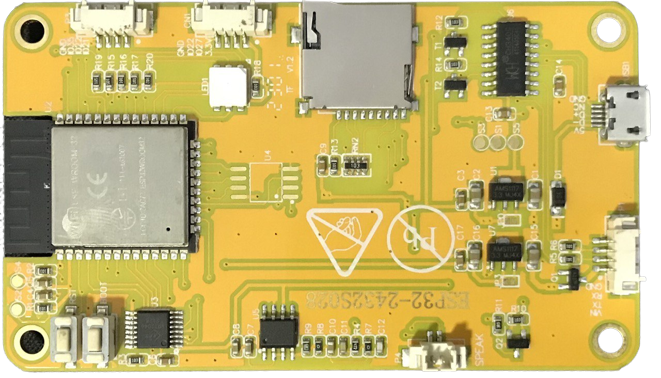

# ESP32-2432S028

chip:esp32, chip:esp32wrover32

The ESP32-2432S028 is a development board based on an ESP32-WROVER-32
module. It is designed for a wide range of applications, particularly in
the field of the Internet of Things (IoT).

|                                                                  |                                                                |
| ---------------------------------------------------------------- | -------------------------------------------------------------- |
|  |  |

## Features

>   - LCD screen (2.8 inch)
>   - MicroSD card slot
>   - RGB LED
>   - Audio
>   - Light Dependent Resistor (LDR)

Most of I/O pins are broken out to the boards, but from the back side of
the board, there are some pins available are separated into two
connectors femme JST 1.28 mm 4P.

## Serial Console

UART0 is, by default, the serial console. It connects to the on-board
CH340 converter.

## Buttons and LEDs

### Board Buttons

There are two buttons labeled BOOT and RST. The RST button is not
available to software. It pulls the chip enable line that doubles as a
reset line.

The BOOT button is connected to IO0. On reset it is used as a strapping
pin to determine whether the chip boots normally or into the serial
bootloader. After reset, however, the BOOT button can be used for
software input.

### Board LEDs

There is one RGB LED available.

## Pin Mapping

| Pin                              | Signal                                                                                                                      | Notes |
| -------------------------------- | --------------------------------------------------------------------------------------------------------------------------- | ----- |
| 0 2 4 12 13 14 15 16 17 21 26 34 | BOOT Button LCD Reset RGB LED Green LCD MISO LCD MOSI LCD Clock LCD CS RGB LED Blue RGB LED Red LCD Backlight Audio Out LDR |       |

## Configurations

All of the configurations presented below can be tested by running the
following commands:

     ./tools/configure.sh esp32-2432S028:<config_name>
     make flash ESPTOOL_PORT=/dev/ttyUSB0 -j

Where \<config\_name\> is the name of board configuration you want to
use, i.e.: nsh, buttons, wifi... Then use a serial console terminal like
`picocom` configured to 115200 8N1.

### lvgl

This is a demonstration of the LVGL graphics library running on the
NuttX LCD driver. You can find LVGL here:

    https://www.lvgl.io/
    https://github.com/lvgl/lvgl

This configuration uses the LVGL demonstration at
apps/examples/lvgldemo.

### nsh

Basic NuttShell configuration (console enabled in UART0, exposed via USB
connection by means of CH340 converter, at 115200 bps).
