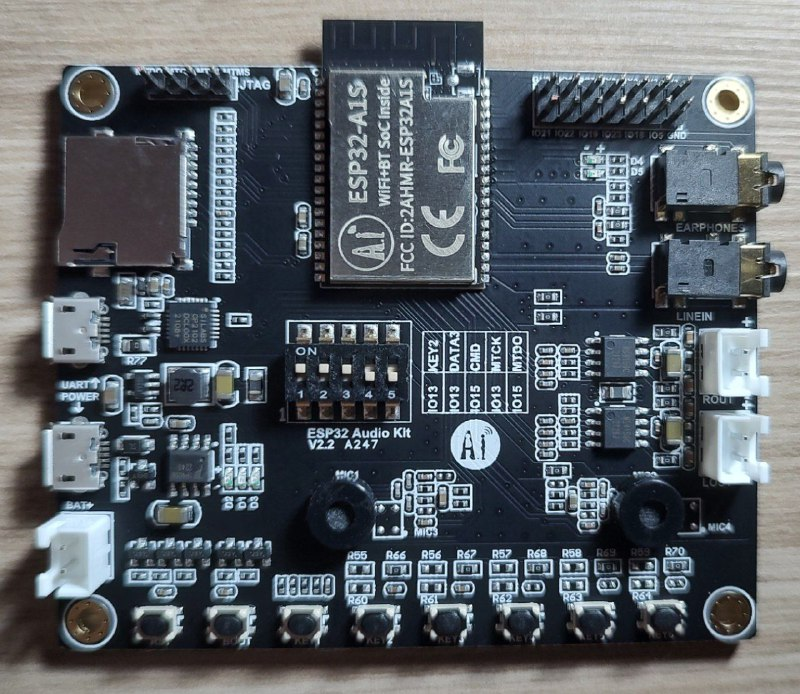
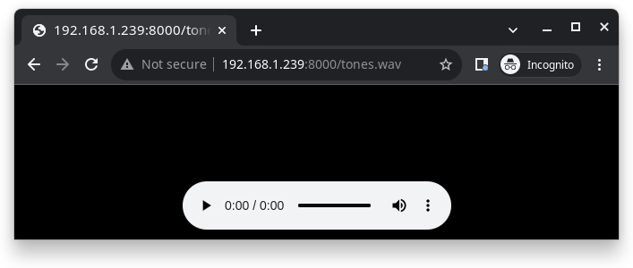

ESP32-AUDIO-KIT
===============

chip:esp32, chip:esp32a1s

The [Ai-Thinker ESP32 Audio
Kit](https://docs.ai-thinker.com/en/esp32-audio-kit) is a development
board for the ESP32 SoC from Espressif, based on Ai-Thinker ESP32-A1S
audio module.

  -------------------------------------------------------------------------
  {.align-center}
  -------------------------------------------------------------------------

Features
--------

> -   ESP32-A1S module
> -   Audio Earphones Output
> -   Audio LINEIN Input
> -   2 Microphones in the board (stereo audio input)
> -   8 Buttons in the boards (1 RST Button and 7 user buttons)
> -   MicroSD card slot

Some of the ESP32 I/O pins are broken out to the board\'s pin header.

Serial Console
--------------

UART0 is, by default, the serial console. It connects to the on-board
Silabs CP2102 converter and is available on the USB connector (UART
label).

It will show up as /dev/ttyUSB\[n\] where \[n\] normally is 0 if you
don\'t have another USB/Serial adapter connected in your computer.

Buttons and LEDs
----------------

### Board Buttons

There are eight buttons labeled as RST, BOOT, KEY1..KEY6. The RST button
is not available to software.

The BOOT button is connected to IO0. On reset it is used as a strapping
pin to determine whether the chip boots normally or into the serial
bootloader. After reset, however, the BOOT button can be used for
software input.

### Board LEDs

There are several on-board LEDs for that indicate the presence of power
and USB activity.

I/O Mapping
-----------

  I/O                       Signal                                                                                                        Notes
  ------------------------- ------------------------------------------------------------------------------------------------------------- --------------
  0 2 4 5 12                BOOT Button DATA0 SDCard DATA1 SDCard KEY6 Button DATA2 SDCard                                                
  13 14                     KEY2 Button/DATA3 SDCard CLK SDCard                                                                           (DIP Switch)
  15 18 19 21 22 23 34 36   CMD SDCard/JTAG MTDO KEY5 Button KEY3 Button/LED5 CTRL Audio AMP LED4 KEY4 Button SDCard Detect KEY1 Button   (DIP Switch)

Configurations
--------------

All of the configurations presented below can be tested by running the
following commands:

     ./tools/configure.sh esp32-audio-kit:<config_name>
     make flash ESPTOOL_PORT=/dev/ttyUSB0 -j

Where \<config\_name\> is the name of board configuration you want to
use, i.e.: nsh, buttons, wifi\... Then use a serial console terminal
like `minicom` or `picocom` configured to 115200 8N1.

### audio

This configuration uses the I2S0 peripheral and the ES8388 audio codec
present on the ESP32-Audio-Kit board to play an audio file streamed over
HTTP while connected to a Wi-Fi network.

**Simple HTTP server**

Prepare a PCM-encoded ([.wav]{.title-ref}) audio file with 16
bits/sample (sampled at 44.1kHz). This file must be placed into a folder
in a computer that could be accessed on the same Wi-Fi network the ESP32
will be connecting to.

Python provides a simple HTTP server. [cd]{.title-ref} to the audio file
folder on the PC and run:

     python3 -m http.server

    Serving HTTP on 0.0.0.0 port 8000 (http://0.0.0.0:8000/)

Look for your PC IP address and test playing the prepared audio on your
browser:

{.align-center}

After successfully built and flashed, connect the board to the Wi-Fi
network:

     nsh> wapi psk wlan0 mypasswd 3
     nsh> wapi essid wlan0 myssid 1
     nsh> renew wlan0

Once connected, open NuttX\'s player and play the file according to its
file name and the IP address of the HTTP server (For example
[tone.wav]{.title-ref} and [192.168.1.239:8000]{.title-ref},
respectively):

     nsh> nxplayer
     nxplayer> play http://192.168.1.239:8000/tone.wav

Note

The codec implementation on the LyraT board was validated using 16-bit,
44.1kHz WAV files. Other configurations might not work as expected.

### nsh

Basic NuttShell configuration (console enabled in UART0, exposed via USB
connection by means of FT2232HL converter, at 115200 bps).

### wifi

Enables Wi-Fi support. You can define your credentials this way:

     make menuconfig
    -> Application Configuration
        -> Network Utilities
            -> Network initialization (NETUTILS_NETINIT [=y])
                -> WAPI Configuration

Or if you don\'t want to keep it saved in the firmware you can do it at
runtime:

    nsh> wapi psk wlan0 mypasswd 3
    nsh> wapi essid wlan0 myssid 1
    nsh> renew wlan0

Tip

Please refer to
`ESP32 Wi-Fi Station Mode <esp32_wi-fi_sta>`{.interpreted-text
role="ref"} for more information.
