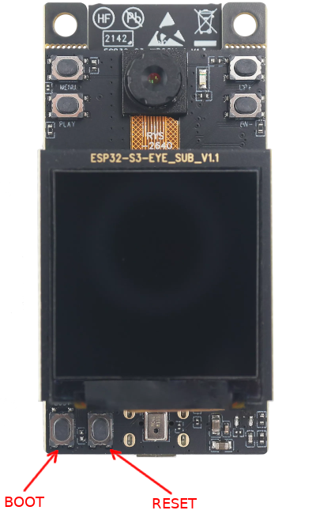

ESP32-S3-EYE
============

chip:esp32, chip:esp32s3

The
[ESP32-S3-EYE](https://github.com/espressif/esp-who/blob/master/docs/en/get-started/ESP32-S3-EYE_Getting_Started_Guide.md)
is a small-sized AI development board from Espressif featuring the
ESP32-S3 CPU with a 2-Megapixel camera, an LCD display, a microphone, an
8 MB Octal PSRAM and an 8 MB flash.

  -------------------------------------
  {.align-center}
  -------------------------------------

Features
--------

> -   ESP32-S3 WROOM-1 Module
> -   USB micro USB port (it uses internal USB JTAG SERIAL device for
>     flashing)
> -   Power LED
> -   LCD Display
> -   2-MP Camera
> -   MEMS Microphone
> -   8MB Octal PSRAM
> -   8MB SPI Flash
> -   RST and BOOT buttons (BOOT accessible to user)

Configurations
--------------

All of the configurations presented below can be tested by running the
following commands:

     ./tools/configure.sh esp32s3-eye:<config_name>
     make flash ESPTOOL_PORT=/dev/ttyUSB0 -j

Where \<config\_name\> is the name of board configuration you want to
use, i.e.: nsh, buttons, wifi\... Then use a serial console terminal
like `picocom` configured to 115200 8N1.

### nsh

Basic NuttShell configuration (console enabled in USB JTAG SERIAL
Device, exposed via USB connection at 9600 bps).

### usbnsh

Basic NuttShell configuration console enabled over USB Device (USB
CDC/ACM).

Before using this configuration, please confirm that your computer
detected that USB JTAG/serial interface used to flash the board:

    usb 3-5.2.3: New USB device strings: Mfr=1, Product=2, SerialNumber=3
    usb 3-5.2.3: Product: USB JTAG/serial debug unit
    usb 3-5.2.3: Manufacturer: Espressif
    usb 3-5.2.3: SerialNumber: XX:XX:XX:XX:XX:XX
    cdc_acm 3-5.2.3:1.0: ttyACM0: USB ACM device

Then you can run the configuration and compilation procedure:

     ./tools/configure.sh esp32s3-eye:usbnsh
     make flash ESPTOOL_PORT=/dev/ttyACM0 -j8

Then run the minicom configured to /dev/ttyACM0 115200 8n1 and press
\<ENTER\> three times to force the nsh to show up:

    NuttShell (NSH) NuttX-12.1.0
    nsh> ?
    help usage:  help [-v] [<cmd>]

        .         break     dd        exit      ls        ps        source    umount
        [         cat       df        false     mkdir     pwd       test      unset
        ?         cd        dmesg     free      mkrd      rm        time      uptime
        alias     cp        echo      help      mount     rmdir     true      usleep
        unalias   cmp       env       hexdump   mv        set       truncate  xd
        basename  dirname   exec      kill      printf    sleep     uname

    Builtin Apps:
        nsh  sh
    nsh> uname -a
    NuttX 12.1.0 38a73cd970 Jun 18 2023 16:58:46 xtensa esp32s3-eye
    nsh>

Flashing
--------

Because ESP32-S3 doesn\'t use an external USB/Serial chip like others
ESP32 boards you should put it in programming mode this way:

> 1)  Press and hold BOOT and RESET (RST) buttons at same time;
> 2)  Release the RESET button and keep BOOT button pressed;
> 3)  After one or more seconds release the BOOT button;
> 4)  Run the flashing command: make flash ESPTOOL\_PORT=/dev/ttyACM0

Serial Console
--------------

The internal USB JTAG SERIAL Device, by default, is used as serial
console. It is normally detected by Linux host as a USB CDC/ACM serial
device.

It will show up as /dev/ttyACM\[n\] where \[n\] will probably be 0.

You can use minicom with /dev/ttyACM0 port at 9600 8n1 or picocom this
way:

> \ picocom -b9600 /dev/ttyACM0

Buttons and LEDs
----------------

### Board Buttons

There are two buttons labeled BOOT and RST. The RST button is not
available to software. It pulls the chip enable line that doubles as a
reset line.

The BOOT button is connected to IO0. On reset it is used as a strapping
pin to determine whether the chip boots normally or into the serial
bootloader. After reset, however, the BOOT button can be used for
software input.

### Board LEDs

There are several on-board LEDs for that indicate the presence of power
and USB activity. None of these are available for use by software.

Pin Mapping
-----------

To be updated

  Pin   Signal   Notes
  ----- -------- -------
  ?     ?        ?
