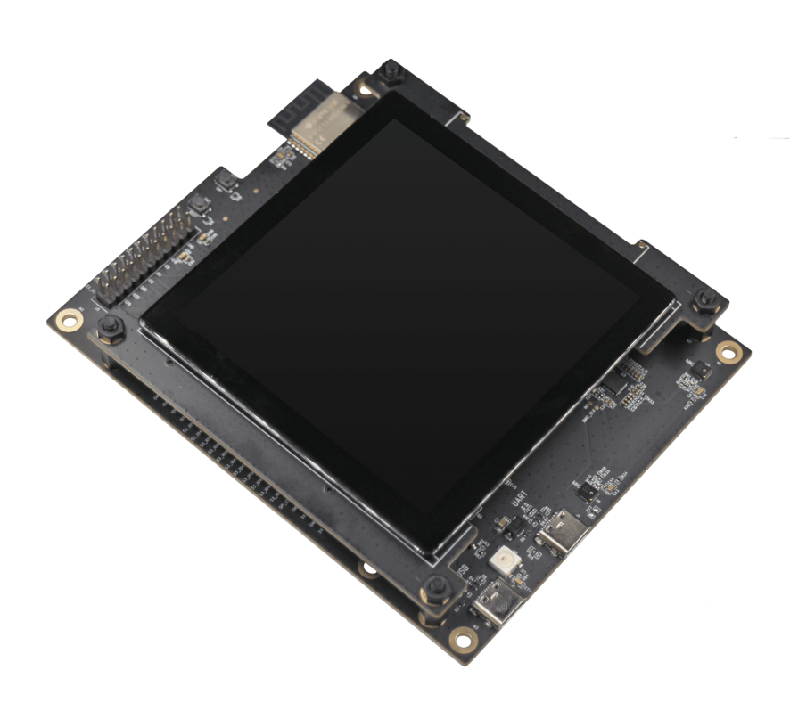

ESP32-S3-LCD-EV
===============

chip:esp32, chip:esp32s3

The
[ESP32-S3-LCD-EV-Board](https://docs.espressif.com/projects/esp-dev-kits/en/latest/esp32s3/esp32-s3-lcd-ev-board/user_guide.html)
is a small-sized AI development board from Espressif featuring the
ESP32-S3 CPU with a touchscreen LCD display, dual microphone, an 16 MB
Octal PSRAM and an 16 MB flash.

  ----------------------------------------
  {.align-center}
  ----------------------------------------

Features
--------

> -   ESP32-S3 WROOM-1 Module
> -   USB Type-C ports
> -   Power LED
> -   LCD Display
> -   MEMS Microphone
> -   16MB Octal PSRAM
> -   16MB SPI Flash
> -   RST and BOOT buttons (BOOT accessible to user)

Serial Console
--------------

UART0 is, by default, the serial console. It connects to the on-board
CP2102 converter and is available on the USB connector USB CON8 (J1).

It will show up as /dev/ttyUSB\[n\] where \[n\] will probably be 0.

Buttons and LEDs
----------------

### Board Buttons

There are two buttons labeled Boot and EN. The EN button is not
available to software. It pulls the chip enable line that doubles as a
reset line.

The BOOT button is connected to IO0. On reset it is used as a strapping
pin to determine whether the chip boots normally or into the serial
bootloader. After reset, however, the BOOT button can be used for
software input.

### Board LEDs

There are several on-board LEDs for that indicate the presence of power
and USB activity. None of these are available for use by software.
Another WS2812 LED is connected to GPIO4.

Configurations
--------------

All of the configurations presented below can be tested by running the
following commands:

     ./tools/configure.sh esp32s3-lcd-ev:<config_name>
     make flash ESPTOOL_PORT=/dev/ttyUSB0 -j

Where \<config\_name\> is the name of board configuration you want to
use, i.e.: nsh, buttons, wifi\... Then use a serial console terminal
like `picocom` configured to 115200 8N1.

### audio

This configuration uses the I2S0 peripheral and an externally connected
audio codec to play an audio file streamed over an HTTP connection while
connected to a Wi-Fi network.

**Audio Codec Setup**

The CS4344 audio codec is connected to the following pins:

  ESP32-S3 Pin   CS4344 Pin   Description
  -------------- ------------ ----------------------------------------------
  5              MCLK         Master Clock
  16             SCLK         Serial Clock
  7              LRCK         Left Right Clock (Word Select)
  6              SDIN         Serial Data In on CS4344. (DOUT on ESP32-S3)

**Simple HTTP server**

Prepare a PCM-encoded ([.wav]{.title-ref}) audio file with 16 or 24
bits/sample (sampled at 16\~48kHz). This file must be placed into a
folder in a computer that could be accessed on the same Wi-Fi network
the ESP32 will be connecting to.

Python provides a simple HTTP server. `cd` to the audio file folder on
the PC and run:

     python3 -m http.server
    Serving HTTP on 0.0.0.0 port 8000 (http://0.0.0.0:8000/)

Look for your PC IP address and test playing the prepared audio on your
browser:

{.align-center}

After successfully built and flashed, connect the board to the Wi-Fi
network:

    nsh> wapi psk wlan0 mypasswd 3
    nsh> wapi essid wlan0 myssid 1
    nsh> renew wlan0

Once connected, open NuttX\'s player and play the file according to the
filename and the IP address of the HTTP server:

    nsh> nxplayer
    nxplayer> play http://192.168.1.239:8000/tones.wav

### buttons

This configuration shows the use of the buttons subsystem. It can be
used by executing the `buttons` application and pressing on any of the
available board buttons:

    nsh> buttons
    buttons_main: Starting the button_daemon
    buttons_main: button_daemon started
    button_daemon: Running
    button_daemon: Opening /dev/buttons
    button_daemon: Supported BUTTONs 0x01
    nsh> Sample = 1
    Sample = 0

### lvgl

This is a demonstration of the LVGL graphics library running on the
NuttX LCD driver. You can find LVGL here:

    https://www.lvgl.io/
    https://github.com/lvgl/lvgl

This configuration uses the LVGL demonstration at
[apps/examples/lvgldemo]{.title-ref}.

### nsh

Basic NuttShell configuration (console enabled in UART0, exposed via USB
connection by means of CP2102 converter, at 115200 bps).

### ws2812

This configuration enables the usage of the RMT peripheral and the
example `ws2812` to drive addressable RGB LEDs:

    nsh> ws2812

Please note that this board contains an on-board WS2812 LED connected to
GPIO38 and, by default, this config configures the RMT transmitter in
the same pin.
